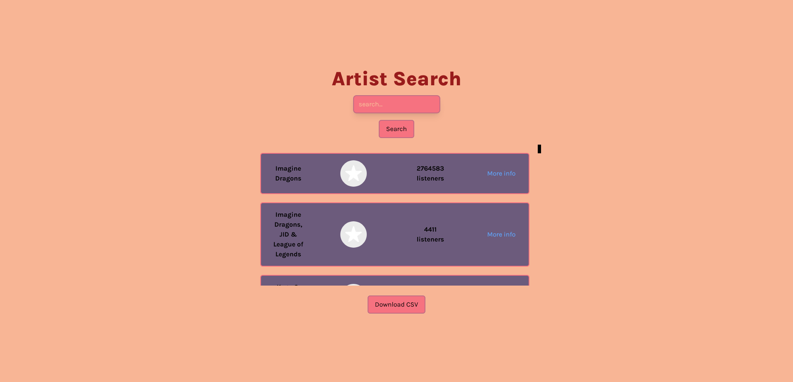

# Last.fm Artist Search



Live website: https://fatihbulbul1.github.io/artist-search/

# Overview

## Made by:

### Client side:

- **React**
- TypeScript
- Tailwind CSS

### Server side:

- Express.js

## Installation

### Client side:

Setting up and running:

```
npm install
npm run dev
```

### Server side:

Setting up and running:

```
npm install
npm start
```

Change `.env-sample` file with your Last.fm API key.

## Description

- This project is fully responsible designed.
- You can preview name, photo, and viewer infos and also download name, mbid, url, and image fields as CSV file.
- Default artists for unknown search queries: `const options = ["Manga", "Imagine Dragons", "Sia"];`

### Author

- LinkedIn - [Ömer Fatih Bülbül](https://www.linkedin.com/in/ömer-fatih-bülbül-74a890236/)
- Twitter - [fatihbulbul91](https://twitter.com/fatihbulbul91)
